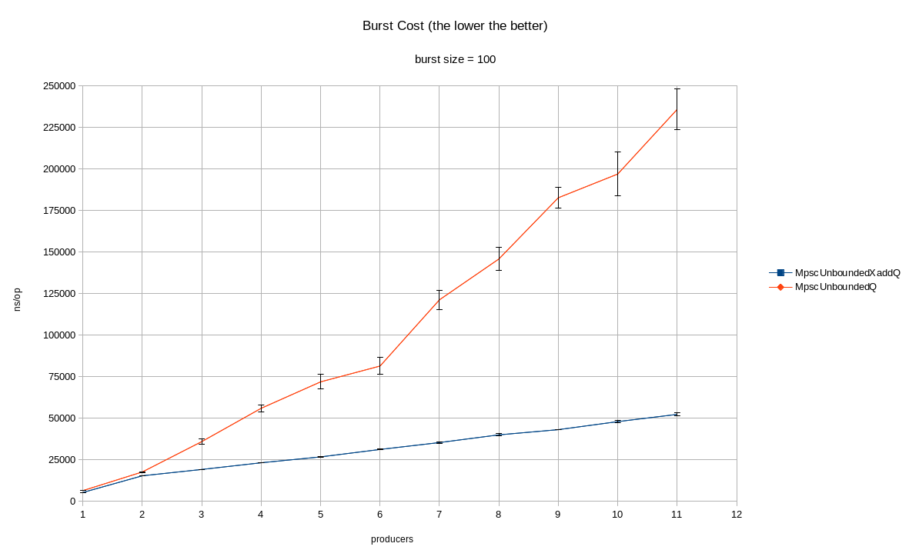

# What's a [MpscUnboundedXaddArrayQueue](https://github.com/JCTools/JCTools/blob/master/jctools-core/src/main/java/org/jctools/queues/MpscUnboundedXaddArrayQueue.java)? 

As the first part of the queue's name suggests (ie `Mpsc`) this queue should be used in a multi-producer single-consumer scenario and is both *unbounded* and *chunked*, meaning  that it grows in chunks of predefined size, without limit on the overall queue's size.
The queue is using a (doubly) linked list of fixed size arrays: as the consumer catches up with the producers, the redundant chunks will be left for GC or recycled, according to the queue configuration, to limit the queue footprint while empty. 

So, why use it, if it seems to cover the same use cases of a `MpscUnboundedArrayQueue`?

The `MpscUnboundedArrayQueue`'s offer side algorithm uses a [compare and swap](https://en.wikipedia.org/wiki/Compare-and-swap) instruction to both control the growth of the queue in chunks and move forward the `producerIndex` to allow a producer to make progress.
In a scenario with many producer threads it means that such `compare and swap` instruction could be reattempted several times (on the same offer) due to the producer winning the race and making progress in place of the "failing" ones. In theory, this means that an offer may take an infinite amount of `compare and swap` attempts to complete, but in practice it's likely to complete after a finite amount of it.

The `MpscUnboundedXaddArrayQueue`'s offer makes use of [fetch and add](https://en.wikipedia.org/wiki/Fetch-and-add) instruction to move forward the `producerIndex`: there are several [articles](https://blogs.oracle.com/dave/atomic-fetch-and-add-vs-compare-and-swap) that compare the behaviour of `fetch and add` vs `compare and swap` , but although on modern architectures it's an established fact that the former provide better progress guarantees and smaller or equals latencies under contention, the most interesting impact is how it changes the logic of the offering algorithm.

From a user perspective, this algorithm allows a producing thread to make progress in a finite number of instructions, bounded to the number of producers: this last part will be better detailed on the next section.

## How it works?

As mentioned previously, the queue is using a doubly linked list of fixed size arrays (ie`AtomicChunk`s).
The tail and head `AtomicChunk`s are being called respectively `producerBuffer` and `consumerBuffer`.
Each `AtomicChunk` has both a `prev` and `next`reference to other `AtomicChunk`s.

Any `AtomicChunk` that represent the content of the queue has a numerical incremental identifier (ie`AtomicChunk::index`), following the same FIFO ordering of the queue eg if the `producerBuffer::index` is 2, its `prev::index` (if not yet consumed) must be 1.

The consumer is responsible to recycle `AtomicChunk`s up to a configured size into a `freeBuffer` pool,  while the producers can append new `AtomicChunk`s or reuse recycled ones by using a ` producerChunkIndex` to ensure the correct sequence of `AtomicChunk::index` on the doubly linked list of `AtomicChunk`s.

The offering side of `MpscUnboundedXaddArrayQueue` can be summarized into these steps:

 - `fetch and add`1 to `producerIndex`
 - compute from the fetched `producerSeq` both the expected `AtomicChunk::index` and `AtomicChunk`'s array position where to write the element
 - if `producerBuffer::index` matches the expected one, write to it
 - if not, try "cooperatively" to append and link the missing `AtomicChunk`s to `producerBuffer` and/or walk (backward or stay still),  if necessary, to reach the expected one and write into it 

The interesting points of the last step of the algorithm are:

- "cooperative" appending and linking of missing `AtomicChunk`s to `producerBuffer`
- safely walking backward to reach the expected `AtomicChunk` 

The former is ensured by using `compare and swap` on a `producerChunkIndex` to guard while appending/linking to `producerBuffer` , using its failure to recognize that another thread has been able to make progress while appending new chunks.
It enables the producer to save further attempts to modify such list, given that each producer try to "fill the gaps" on it by constructing the intermediate `AtomicChunk`s from the expected one.
In addition, during the actual appending, the offering thread can make use of a `freeBuffer` pool of `AtomicChunk` , populated by the consumer, to save the allocation of new ones.

The latter is (mostly) ensured by the single consumer logic: a consumer is allowed to detach (and recycle) a fully consumed `AtomicChunk`  from `consumerBuffer` only if there is a `next` one available.
Given that a pending offer prevents the consumer to detach its`AtomicChunk` and the `producerBuffer` is published only when completly constructed (ie no gaps), if it's next to the expected one ( with greater or equal `AtomicChunk::index`) is safe to walk back from it.

This part has implications from a memory footprint point of view too, because only fully consumed chunks are available to be reused by offering threads, while a `MpscUnboundedArrayQueue` can reuse the same chunk if there is available capacity on it. 

##  Is it for me?

This queue should be picked if it's highly contended by *many* offering threads and it would guarantee a better individual progress for each producer, because if any of them will lag behind due to the offering rate, they will independently be able to chase the expected chunk while helping others to make progress too.

## Lies, Damned Lies and Benchmarks

Some synthetic benchmarks indicate performance improvements: below some results of running [MpqBurstCost](https://github.com/JCTools/JCTools/blob/master/jctools-benchmarks/src/main/java/org/jctools/jmh/latency/MpqBurstCost.java) on `MpscUnboundedXaddArrayQeueue` vs `MpscUnboundedArrayQueue`
with `burstSize` 100 (YMMV, setup attached below).

### Environment

Kernel:
```
Linux 3.10.0-957.12.1.el7.x86_64 #1 SMP
```

CPU:
```
Architecture:          x86_64
CPU op-mode(s):        32-bit, 64-bit
Byte Order:            Little Endian
CPU(s):                48
On-line CPU(s) list:   0-47
Thread(s) per core:    2
Core(s) per socket:    12
Socket(s):             2
NUMA node(s):          2
Vendor ID:             GenuineIntel
CPU family:            6
Model:                 79
Model name:            Intel(R) Xeon(R) CPU E5-2650 v4 @ 2.20GHz
Stepping:              1
CPU MHz:               1200.036
CPU max MHz:           2900.0000
CPU min MHz:           1200.0000
BogoMIPS:              4394.58
Virtualization:        VT-x
L1d cache:             32K
L1i cache:             32K
L2 cache:              256K
L3 cache:              30720K
NUMA node0 CPU(s):     0,2,4,6,8,10,12,14,16,18,20,22,24,26,28,30,32,34,36,38,40,42,44,46
NUMA node1 CPU(s):     1,3,5,7,9,11,13,15,17,19,21,23,25,27,29,31,33,35,37,39,41,43,45,47
Flags:                 fpu vme de pse tsc msr pae mce cx8 apic sep mtrr pge mca cmov pat pse36 clflush dts acpi mmx fxsr sse sse2 ss ht tm pbe syscall nx pdpe1gb rdtscp lm constant_tsc arch_perfmon pebs bts rep_good nopl xtopology nonstop_tsc aperfmperf eagerfpu pni pclmulqdq dtes64 monitor ds_cpl vmx smx est tm2 ssse3 sdbg fma cx16 xtpr pdcm pcid dca sse4_1 sse4_2 x2apic movbe popcnt aes xsave avx f16c rdrand lahf_lm abm 3dnowprefetch epb cat_l3 cdp_l3 intel_pt tpr_shadow vnmi flexpriority ept vpid fsgsbase tsc_adjust bmi1 hle avx2 smep bmi2 erms invpcid rtm cqm rdt_a rdseed adx smap xsaveopt cqm_llc cqm_occup_llc cqm_mbm_total cqm_mbm_local dtherm ida arat pln pts
```
JMH + JVM:
```
# JMH version: 1.21
# VM version: JDK 1.8.0_222, OpenJDK 64-Bit Server VM, 25.222-b10
```
Has been run on *real* `NUMA node0` CPUs:
```
$ taskset -pc 0,2,4,6,8,10,12,14,16,18,20,22 $$
```
### Results

##### 1 PRODUCER
```
Benchmark               (burstSize)  (consumerCount)                      (qType)  Mode  Cnt     Score    Error  Units
MpqBurstCost.burstCost          100                1  MpscUnboundedXaddArrayQueue  avgt  100  5337.122 ± 16.853  ns/op
MpqBurstCost.burstCost          100                1      MpscUnboundedArrayQueue  avgt  100  6441.541 ± 32.471  ns/op
```
##### 2 PRODUCERS
```
Benchmark               (burstSize)  (consumerCount)                      (qType)  Mode  Cnt      Score     Error  Units
MpqBurstCost.burstCost          100                1  MpscUnboundedXaddArrayQueue  avgt  100  15372.144 ±  67.949  ns/op
MpqBurstCost.burstCost          100                1      MpscUnboundedArrayQueue  avgt  100  17667.965 ± 215.614  ns/op
```
##### 3 PRODUCERS
```
Benchmark               (burstSize)  (consumerCount)                      (qType)  Mode  Cnt      Score      Error  Units
MpqBurstCost.burstCost          100                1  MpscUnboundedXaddArrayQueue  avgt  100  19183.208 ±  104.460  ns/op
MpqBurstCost.burstCost          100                1      MpscUnboundedArrayQueue  avgt  100  35929.088 ± 1645.079  ns/op
```
##### 4 PRODUCERS
```
Benchmark               (burstSize)  (consumerCount)                      (qType)  Mode  Cnt      Score      Error  Units
MpqBurstCost.burstCost          100                1  MpscUnboundedXaddArrayQueue  avgt  100  23191.906 ±  124.903  ns/op
MpqBurstCost.burstCost          100                1      MpscUnboundedArrayQueue  avgt  100  55969.883 ± 2150.159  ns/op
```
##### 5 PRODUCERS
```
Benchmark               (burstSize)  (consumerCount)                      (qType)  Mode  Cnt      Score      Error  Units
MpqBurstCost.burstCost          100                1  MpscUnboundedXaddArrayQueue  avgt  100  26737.987 ±  156.193  ns/op
MpqBurstCost.burstCost          100                1      MpscUnboundedArrayQueue  avgt  100  71869.724 ± 4381.868  ns/op
```
##### 6 PRODUCERS
```
Benchmark               (burstSize)  (consumerCount)                      (qType)  Mode  Cnt      Score      Error  Units
MpqBurstCost.burstCost          100                1  MpscUnboundedXaddArrayQueue  avgt  100  31205.720 ±  292.838  ns/op
MpqBurstCost.burstCost          100                1      MpscUnboundedArrayQueue  avgt  100  81381.228 ± 5137.248  ns/op
```
##### 7 PRODUCERS
```
Benchmark               (burstSize)  (consumerCount)                      (qType)  Mode  Cnt       Score      Error  Units
MpqBurstCost.burstCost          100                1  MpscUnboundedXaddArrayQueue  avgt  100   35355.732 ±  455.559  ns/op
MpqBurstCost.burstCost          100                1      MpscUnboundedArrayQueue  avgt  100  121220.193 ± 5680.209  ns/op
```
##### 8 PRODUCERS
```
Benchmark               (burstSize)  (consumerCount)                      (qType)  Mode  Cnt       Score      Error  Units
MpqBurstCost.burstCost          100                1  MpscUnboundedXaddArrayQueue  avgt  100   39983.888 ±  744.112  ns/op
MpqBurstCost.burstCost          100                1      MpscUnboundedArrayQueue  avgt  100  145801.135 ± 6915.746  ns/op
```
##### 9 PRODUCERS
```
Benchmark               (burstSize)  (consumerCount)                      (qType)  Mode  Cnt       Score      Error  Units
MpqBurstCost.burstCost          100                1  MpscUnboundedXaddArrayQueue  avgt  100   43125.184 ±  113.251  ns/op
MpqBurstCost.burstCost          100                1      MpscUnboundedArrayQueue  avgt  100  182623.533 ± 6270.762  ns/op
```
##### 10 PRODUCERS
```
Benchmark               (burstSize)  (consumerCount)                      (qType)  Mode  Cnt       Score       Error  Units
MpqBurstCost.burstCost          100                1  MpscUnboundedXaddArrayQueue  avgt  100   47939.348 ±   726.799  ns/op
MpqBurstCost.burstCost          100                1      MpscUnboundedArrayQueue  avgt  100  196898.212 ± 13196.006  ns/op
```
##### 11 PRODUCERS
```
Benchmark               (burstSize)  (consumerCount)                      (qType)  Mode  Cnt       Score       Error  Units
MpqBurstCost.burstCost          100                1  MpscUnboundedXaddArrayQueue  avgt  100   52302.421 ±   838.073  ns/op
MpqBurstCost.burstCost          100                1      MpscUnboundedArrayQueue  avgt  100  235790.766 ± 12166.894  ns/op
```

Or, more visually:

